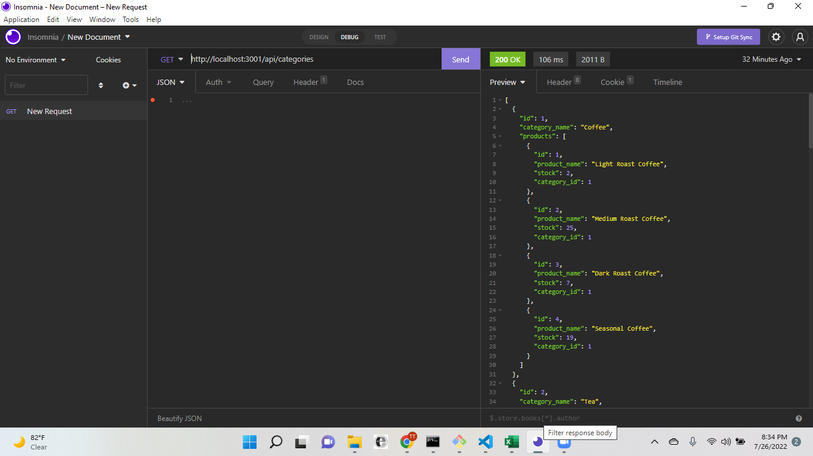

# Invetory-manager

## Description

 This is a warehouse that has deferent products. Consumers are prompted to log in and make a choice of what they would like to view and purchase.

## Table Of Contents

* [Installations](#dependencies)

* [Usage](#usage)

* [License](#license)

* [Contributors](#contributors)

* [Test](#test)

## dependencies

To install dependencies, run the following code:

npm init\
npm install express\
npm install sequalize\
npm install dotenv\
npm install mysql2\
npm install handlebars

## usage

## license

Copyright © MIT. All rights reserved.

      Licensed under the MIT license.

## contributors

Terrence Mashoro\
Jessica Hoffman\
Jack Atkerson\
[tmashoro](https://github.com/tmashoro/)\
[jackAtkerson](https://github.com/JackAtkerson)\
[JessicaHoffman](https://github.com/SidhLore)

## test
